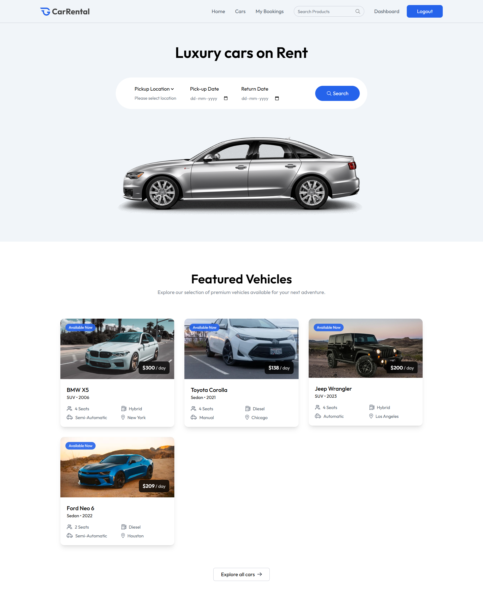
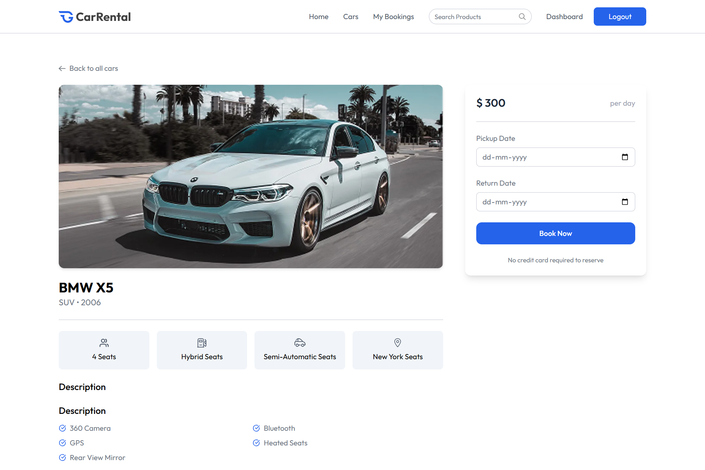

#  CarRental

A full-stack car rental web application that allows users to browse, book, and manage car rentals with seamless image uploads and secure authentication.

---

## 🔗 Live Demo

Try it out: [CarRental Live Site](https://carrental-frontend-e38k.onrender.com/)

## 🎨 Preview





---

## 🚀 Tech Stack

* 🧩 **Frontend:** Vite + React
* 🛠️ **Backend:** Node.js + Express
* 💾 **Database:** MongoDB
* 🖼️ **Image Uploads:** ImageKit

## 📁 Repository Structure

```
CarRental/
├── frontend/       # React client application
└── backend/        # Express API server
```

## 🔧 Installation & Setup

Follow these steps to get the project up and running locally.

### 1️⃣ Clone the repository

```bash
git clone https://github.com/Krishna200608/CarRental.git
cd CarRental
```

### 2️⃣ Frontend Setup

```bash
cd frontend
npm install
```

* 📝 Create a `.env` file in the `frontend` folder based on `.env.example`.

```env
VITE_CURRENCY=your_currency_symbol
VITE_BASE_URL=https://your-backend-api-url.com
```

* ▶️ Start the development server:

```bash
npm start
```

### 3️⃣ Backend Setup

```bash
cd backend
npm install
```

* 📝 Create a `.env` file in the `backend` folder based on `.env.example`.

```env
MONGODB_URI=your_mongo_connection_string
JWT_SECRET=your_jwt_secret

# ImageKit Configuration
IMAGEKIT_PUBLIC_KEY=your_imagekit_public_key
IMAGEKIT_PRIVATE_KEY=your_imagekit_private_key
IMAGEKIT_URL_ENDPOINT=https://your_imagekit_url
```

* ▶️ Start the server:

```bash
npm run server
```

## ⚙️ Environment Variables Reference

### Frontend (`frontend/.env`)

| Variable        | Description                         | Example                 |
| --------------- | ----------------------------------- | ----------------------- |
| `VITE_CURRENCY` | Currency symbol for pricing display | `$`                     |
| `VITE_BASE_URL` | URL of the backend API              | `http://localhost:3000` |

### Backend (`backend/.env`)

| Variable                | Description                      | Example                                   |
| ----------------------- | -------------------------------- | ----------------------------------------- |
| `MONGODB_URI`           | MongoDB connection string        | `mongodb+srv://<user>:<pass>@cluster0...` |
| `JWT_SECRET`            | Secret key for signing JWTs      | `your_jwt_secret`                         |
| `IMAGEKIT_PUBLIC_KEY`   | Public key for ImageKit uploads  | `public_xxxxxxx`                          |
| `IMAGEKIT_PRIVATE_KEY`  | Private key for ImageKit uploads | `private_xxxxxxx`                         |
| `IMAGEKIT_URL_ENDPOINT` | URL endpoint for ImageKit CDN    | `https://ik.imagekit.io/your_imagekit_id` |

## 🎯 Features

* 🔐 User authentication with JWT
* 🚗 Browse and search available cars
* 📷 Upload and display car images via ImageKit
* 📅 Book cars with date selection and pricing
* 🛠️ Admin dashboard for managing cars and bookings

## 📜 Available Scripts

### Frontend

* ▶️ `npm start` — Runs the app in development mode
* 🏗️ `npm run build` — Builds the app for production

### Backend

* 🔁 `npm run server` — Runs the Express server with live reload
* 🚀 `npm run start` — Runs the server without reload (production)

## 🤝 Contributing

Contributions are welcome! Please fork the repository and create a pull request with your changes.

1️⃣ Fork it
2️⃣ Create your feature branch (`git checkout -b feature/name`)
3️⃣ Commit your changes (`git commit -m 'Add some feature'`)
4️⃣ Push to the branch (`git push origin feature/name`)
5️⃣ Open a Pull Request

---

**Happy coding!**
